<!-- Waving header banner -->

<!-- Typing SVG -->

---

<!-- GitHub profile badges -->

---

## 🧬 About Me

> *"The universe is under no obligation to make sense to you." — Neil deGrasse Tyson*

I'm a passionate developer who loves exploring the intersection of physics, mathematics, and software engineering. Whether it's simulating quantum systems or building tools to understand the cosmos, I believe code is the language of the universe.

- 🔭 Currently working on open-source physics simulations
- 🌱 Always learning — currently deep-diving into quantum computing & ML
- 💬 Ask me about Python, scientific computing, or space exploration
- 🤝 Looking to collaborate on meaningful open-source projects
- ⚡ Fun fact: I can explain Schrödinger's cat in 30 seconds

---

## 📊 GitHub Overview

> Classic profile metrics showing activity, community engagement, repositories, and metadata.

  

---

## 🙋 Introduction

> A brief introduction to who I am on GitHub.

  

---

## 📅 Isometric Commit Calendar

> My contribution history visualized as a beautiful isometric 3-D calendar spanning a full year.

  

---

## 📆 Full Commit Calendar

> Complete commit history calendar from the very first contribution.

  

---

## 🈷️ Programming Languages

> In-depth analysis of the languages I use most, based on repository content and recent activity.

  

---

## 💡 Coding Habits & Activity

> What time of day I code, which languages I favor, and other interesting behavioral facts.

  

---

## ⏰ WakaTime Coding Stats

> Detailed breakdown of my coding time — languages, editors, projects, and operating systems.
>
> *Powered by [WakaTime](https://wakatime.com). Set `WAKATIME_API_KEY` secret to enable.*

  

---

## 👨‍💻 Lines of Code Changed

> Total lines added and removed across all my repositories over time.

  

---

## ♐ Random Code Snippet

> A random snippet from my recent public commits — a tiny window into what I've been building.

  

---

## 🏆 Achievements

> Badges earned based on my GitHub activity and milestones.

  

---

## 🎩 Notable Contributions

> Contributions I've made to popular open-source repositories (stars > 500).

  

---

## 📰 Recent Activity

> A feed of my latest GitHub actions — commits, pull requests, issues, reviews, and more.

  

---

## ✨ Stargazers Over Time

> How the stars on my repositories have grown, visualised as charts and a world-map.

  

---

## 🌟 Recently Starred Repositories

> Repositories I've recently starred — a peek into what's inspiring me right now.

  

---

## 💫 Star Lists

> Language breakdown and top repositories from my curated star lists.

  

---

## 📌 Starred Topics

> The GitHub topics I've starred, reflecting my areas of interest.

  

---

## 🧑‍🤝‍🧑 People

> My followers and who I'm following on GitHub.

  

---

## 🎟️ Follow-up: Issues & Pull Requests

> In-depth analysis of open, closed, and merged issues / PRs in my repositories.

  

---

## 🎭 Comment Reactions

> The emoji reactions my comments have received across issues, PRs, and discussions.

  

---

## 💬 Discussions

> My GitHub Discussions activity — questions answered, ideas shared, communities built.

  

---

## 📓 Featured Repositories

> Highlighted repositories from my profile that I'm most proud of.

  

---

## 🗂️ GitHub Projects

> Active project boards tracking my work-in-progress features and milestones.

  

---

## 🎫 Gists

> Statistics about my public GitHub Gists.

  

---

## 🧮 Repositories Traffic

> Unique visitors and view counts for my most popular repositories.

  

---

## 📜 Repository Licenses

> License breakdown across my repositories — legal permissions, limitations, and conditions.

  

---

## 🏅 Contributors

> The amazing people who have contributed to this repository.

  

---

## 💝 GitHub Sponsorships

> Projects and developers I sponsor to support the open-source ecosystem.

  

---

## 💕 GitHub Sponsors

> Awesome people who sponsor my open-source work. Thank you! ❤️

  

---

## 🌇 GitHub Skyline

> My contribution history rendered as an animated 3-D city skyline.

  

---

## 🗨️ Stack Overflow

> My top answers and recent questions on Stack Overflow.

  

---

## 🗳️ LeetCode

> My LeetCode solving stats — problems solved by difficulty, skills, and recent submissions.

  

---

## ⏱️ Google PageSpeed

> PageSpeed Insights score for my GitHub profile page.

  

---

## 🌸 Anilist — Anime & Manga

> My anime watch list and manga reading list from Anilist.
>
> *Set `plugin_anilist_user` to your Anilist username to enable.*

  

---

## 🎼 Music — Spotify

> Recently listened tracks and music activity from Spotify.
>
> *Set `SPOTIFY_CLIENT_ID`, `SPOTIFY_CLIENT_SECRET`, and `SPOTIFY_REFRESH_TOKEN` secrets to enable.*

  

---

## 🕹️ Steam

> Recently played games and achievements from my Steam profile.
>
> *Set `STEAM_API_KEY` and `STEAM_USER_ID` secrets to enable.*

  

---

## ✒️ Recent Posts

> My latest articles on dev.to, keeping the community informed about my work.

  

---

## 🗼 RSS Feed — Hacker News

> Latest stories from Hacker News, the community I love keeping up with.

  

---

## 🧠 16Personalities

> My Myers-Briggs / 16Personalities profile — because code reflects personality!
>
> *(Community plugin by [@lowlighter](https://github.com/lowlighter))*

  

---

## ♟️ Chess

> My latest chess games and rating.
>
> *(Community plugin by [@lowlighter](https://github.com/lowlighter) — set `CHESS_TOKEN` secret to enable)*

  

---

## 🥠 Fortune Cookie

> A random programming fortune to brighten your day.
>
> *(Community plugin by [@lowlighter](https://github.com/lowlighter))*

  

---

## 📸 Profile Screenshot

> A live screenshot of my GitHub profile page.
>
> *(Community plugin by [@lowlighter](https://github.com/lowlighter))*

  

---

## 🦑 Splatoon

> My Splatoon 3 player stats, recent versus battles, and Salmon Run results.
>
> *(Community plugin by [@lowlighter](https://github.com/lowlighter) — set `SPLATOON_TOKEN` secret to enable)*

  

---

## 💹 Stock Prices

> Live stock price chart — because I like watching numbers go up (and sometimes down).
>
> *(Community plugin by [@lowlighter](https://github.com/lowlighter) — set `STOCK_TOKEN` secret to enable)*

  

---

## ⚙️ How This README Works

This README is powered by **[lowlighter/metrics](https://github.com/lowlighter/metrics)** — an incredibly versatile GitHub Action that generates SVG metric cards for virtually every aspect of a GitHub profile.

All SVG cards are automatically regenerated every day at midnight UTC via the workflow defined in [`.github/workflows/metrics.yml`](.github/workflows/metrics.yml).

### 🔌 Plugins Used

| Plugin | Description | Status |
|--------|-------------|--------|
| 📊 **Base** | Profile overview, activity, repositories | Always enabled |
| 📅 **Isocalendar** | Isometric 3-D commit calendar | Always enabled |
| 📆 **Calendar** | Full contribution history calendar | Always enabled |
| 🈷️ **Languages** | Programming language breakdown | Always enabled |
| 💡 **Habits** | Coding habits & activity patterns | Always enabled |
| ⏰ **WakaTime** | Coding time tracking | Requires `WAKATIME_API_KEY` |
| 👨‍💻 **Lines** | Lines of code added/removed | Always enabled |
| ♐ **Code** | Random code snippet from recent commits | Always enabled |
| 🏆 **Achievements** | GitHub achievement badges | Always enabled |
| 🎩 **Notable** | Notable contributions to popular repos | Always enabled |
| 📰 **Activity** | Recent GitHub activity feed | Always enabled |
| ✨ **Stargazers** | Stargazer growth charts & world-map | Always enabled |
| 🌟 **Stars** | Recently starred repositories | Always enabled |
| 💫 **Starlists** | Star list languages & repos | Always enabled |
| 📌 **Topics** | Starred GitHub topics | Always enabled |
| 🧑‍🤝‍🧑 **People** | Followers & following | Always enabled |
| 🎟️ **Follow-up** | Issue & PR follow-up analysis | Always enabled |
| 🎭 **Reactions** | Comment reactions received | Always enabled |
| 💬 **Discussions** | GitHub Discussions activity | Always enabled |
| 📓 **Repositories** | Featured repositories | Always enabled |
| 🗂️ **Projects** | GitHub project boards | Always enabled |
| 🎫 **Gists** | Gist statistics | Always enabled |
| 🧮 **Traffic** | Repository traffic | Always enabled |
| 📜 **Licenses** | Repository license breakdown | Always enabled |
| 🏅 **Contributors** | Repository contributors | Always enabled |
| 💝 **Sponsorships** | Outgoing sponsorships | Always enabled |
| 💕 **Sponsors** | Incoming sponsors | Always enabled |
| 🙋 **Introduction** | Profile bio introduction | Always enabled |
| 🌇 **Skyline** | 3-D contribution city skyline | Always enabled |
| 🗨️ **Stack Overflow** | SO answers & questions | Always enabled |
| 🗳️ **LeetCode** | LeetCode problem-solving stats | Always enabled |
| ⏱️ **PageSpeed** | Google PageSpeed Insights | Requires `PAGESPEED_API_KEY` |
| 🌸 **Anilist** | Anime & manga lists | Always enabled |
| 🎼 **Music** | Spotify recently played | Requires Spotify secrets |
| 🕹️ **Steam** | Steam game history | Requires `STEAM_API_KEY` |
| ✒️ **Posts** | dev.to recent articles | Always enabled |
| 🗼 **RSS** | RSS feed (Hacker News) | Always enabled |
| 🧠 **16Personalities** | Personality type | Always enabled |
| ♟️ **Chess** | Chess.com games | Requires `CHESS_TOKEN` |
| 🥠 **Fortune** | Random fortune cookie | Always enabled |
| 📸 **Screenshot** | Profile screenshot | Always enabled |
| 🦑 **Splatoon** | Splatoon 3 stats | Requires `SPLATOON_TOKEN` |
| 💹 **Stock** | Live stock price chart | Requires `STOCK_TOKEN` |

### 🔑 Required Secrets

Add the following secrets in **Settings → Secrets and variables → Actions**:

| Secret | Required | Description |
|--------|----------|-------------|
| `METRICS_TOKEN` | ✅ Yes | Fine-grained PAT with `read:user`, `repo`, `read:org` scopes |
| `WAKATIME_API_KEY` | ⚠️ Optional | [WakaTime](https://wakatime.com) API key |
| `SPOTIFY_CLIENT_ID` | ⚠️ Optional | Spotify app client ID |
| `SPOTIFY_CLIENT_SECRET` | ⚠️ Optional | Spotify app client secret |
| `SPOTIFY_REFRESH_TOKEN` | ⚠️ Optional | Spotify OAuth refresh token |
| `STEAM_API_KEY` | ⚠️ Optional | [Steam Web API](https://steamcommunity.com/dev/apikey) key |
| `STEAM_USER_ID` | ⚠️ Optional | Steam 64-bit user ID |
| `PAGESPEED_API_KEY` | ⚠️ Optional | [Google PageSpeed API](https://developers.google.com/speed/docs/insights/v5/get-started) key |
| `CHESS_TOKEN` | ⚠️ Optional | Chess.com session token |
| `SPLATOON_TOKEN` | ⚠️ Optional | Nintendo Switch Online token |
| `SPLATOON_STATINK_TOKEN` | ⚠️ Optional | stat.ink API token |
| `STOCK_TOKEN` | ⚠️ Optional | Alpha Vantage or similar stock API token |

---

<!-- Tech stack badges -->
### 🛠️ Technologies & Tools

---

### 🌐 Connect With Me

---

<!-- Footer wave -->

*Auto-generated with ❤️ by [lowlighter/metrics](https://github.com/lowlighter/metrics)*

